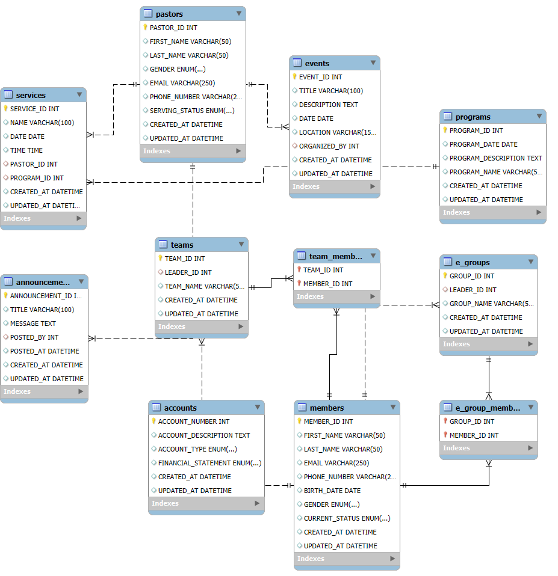

# Church Database Management System

## 📖 Description
A  MySQL database solution for managing church operations sample data of  member records, pastoral staff, ministry teams, small groups, events, services, and financial tracking. This system provides the foundation for a church management software application.

## ✨ Features
- Member information management
- Pastor records with serving status
- Ministry team organization
- Small group (E-group) tracking
- Event and program management
- Service scheduling
- Financial account structure

## 🛠️ Database Schema

*Figure 1: Entity-Relationship Diagram of the Church Database*

## 🚀 Setup Instructions

### Prerequisites
- MySQL Server (version 8.0+ recommended)
- MySQL Workbench or similar database management tool

### Installation
1. Clone this repository:
   ```bash
   git clonehttps://github.com/BEN-ke-DEV/DATABASE_WEEK8.git
2.Open MySQL Workbench

3.Connect to your MySQL server
  
4.Click "File" → "Open SQL Script"
  
5.Select church_db.sql
  
6.Click the lightning bolt icon to execute
  


